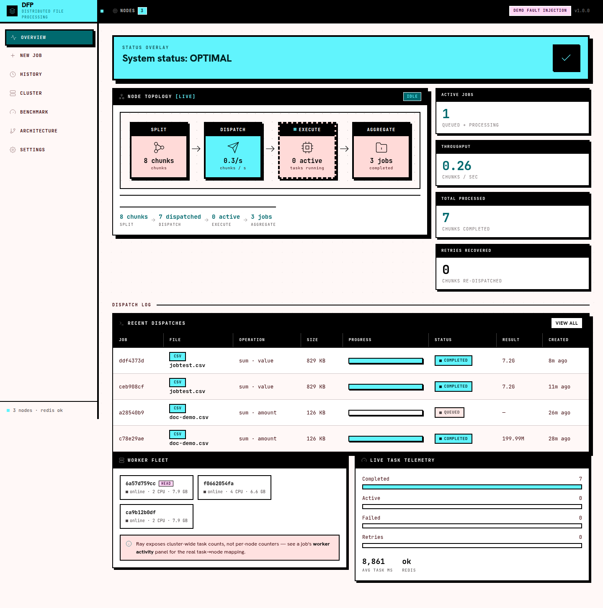
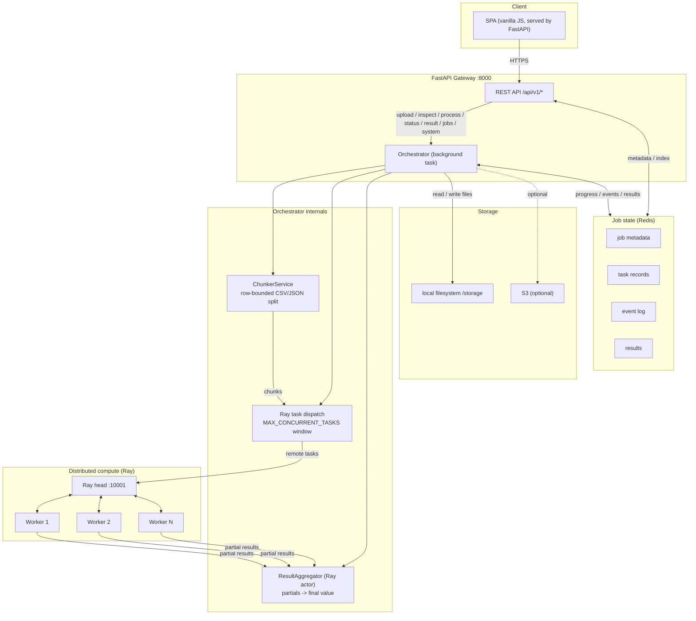
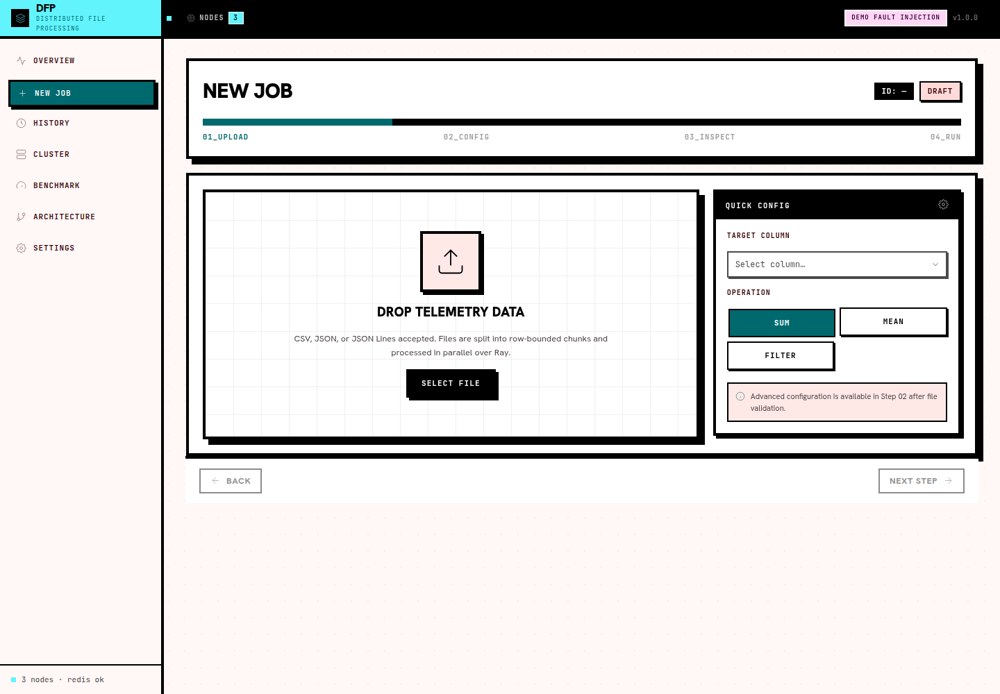
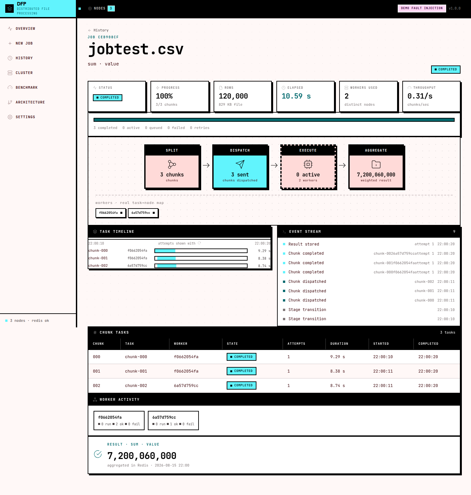
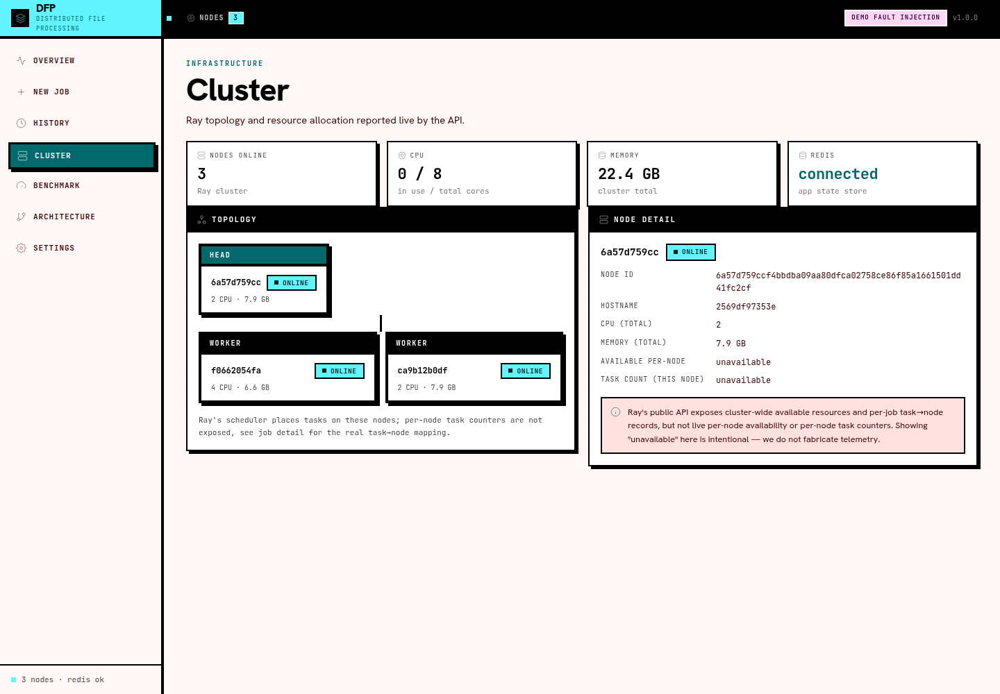
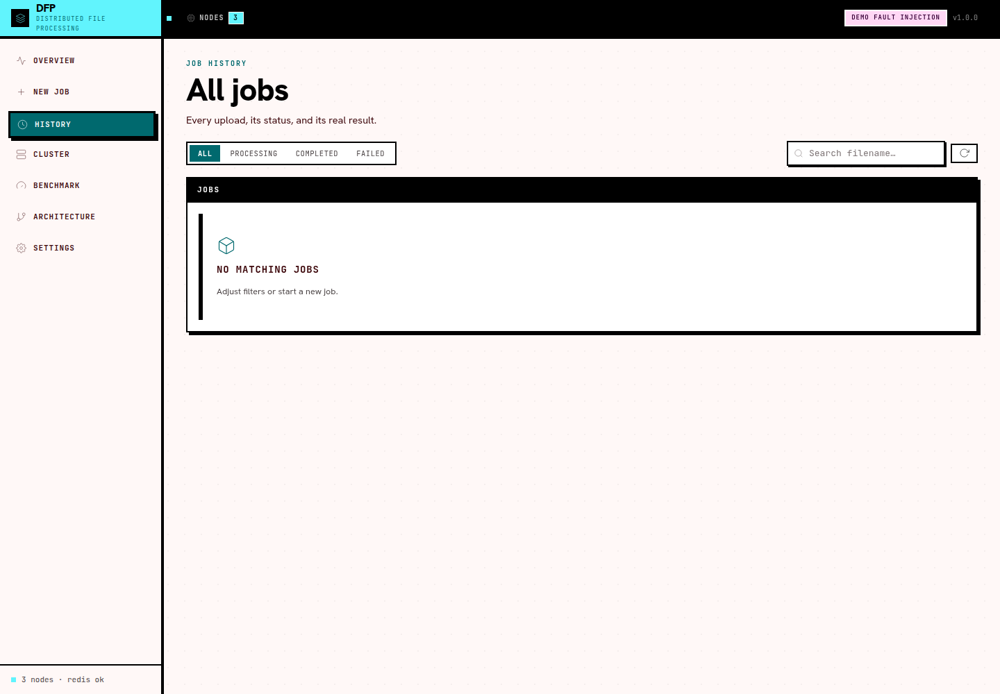
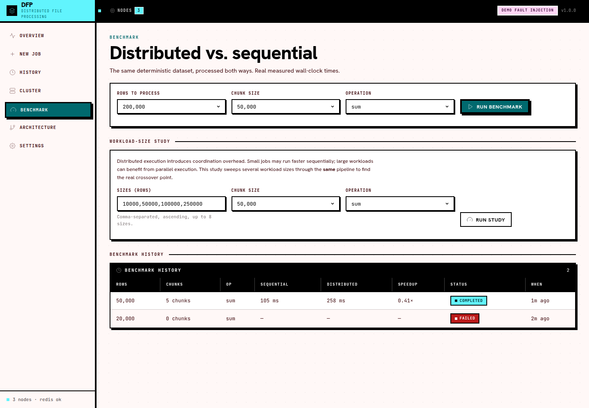
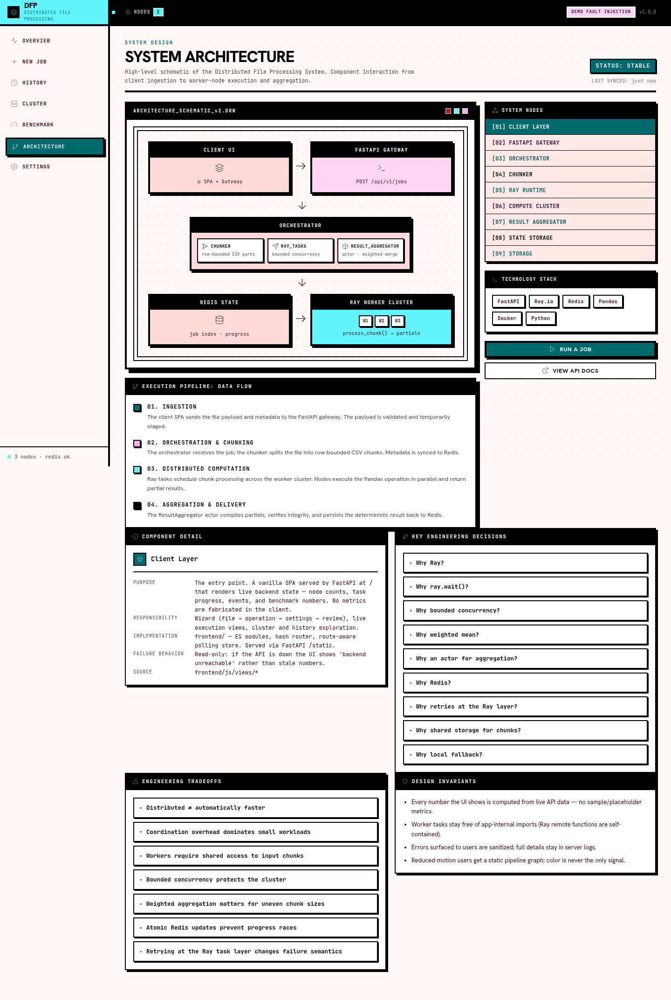

# Distributed File Processing System

> **Split. Dispatch. Execute. Aggregate.**

A production-grade distributed file processing control plane built on **Ray**, **FastAPI**, and **Redis**. Upload CSV or JSON files, split them into configurable row-bounded chunks, process each chunk in parallel across a Ray cluster, and read back the aggregated result — all through a dark, observability-style web UI served directly by FastAPI.

The entire UI is rendered from **real backend state only** — live cluster telemetry, per-chunk task traces, event logs, benchmark comparisons, and fault-injection recovery demos. No fake metrics.



---

## Table of Contents

- [Key Features](#key-features)
- [Architecture](#architecture)
- [UI Screens](#ui-screens)
- [Tech Stack](#tech-stack)
- [Project Structure](#project-structure)
- [Prerequisites](#prerequisites)
- [Quick Start (Development)](#quick-start-development)
- [Production Deployment](#production-deployment)
- [Configuration](#configuration)
- [API Reference](#api-reference)
- [Running Tests](#running-tests)
- [Scaling](#scaling)
- [Monitoring](#monitoring)
- [Security](#security)
- [Troubleshooting](#troubleshooting)

---

## Key Features

### Distributed processing

Files are split into equal-sized chunks and dispatched to Ray workers in parallel. Each `process_chunk` remote function carries `max_retries=2`; failed chunks are retried automatically before a job is marked failed. A Ray actor (`ResultAggregator`) accumulates partial results and computes the weighted final value — `mean` uses `(sum, count)` pairs per chunk so unequal chunk sizes never bias the result. Result collection uses `ray.wait()`, keeping the orchestrator non-blocking and issuing progress updates as each chunk finishes.

### Supported operations

| Operation | Description |
| --- | --- |
| `sum` | Sum of a numeric column across all rows |
| `mean` | Weighted mean of a numeric column (correct across unequal chunk sizes) |
| `filter` | Count of rows where a column matches a given string value |

### File format support

| Format | Details |
| --- | --- |
| CSV | UTF-8 encoding with automatic latin-1 fallback |
| JSON array | Array of objects at the top level |
| JSON Lines | One JSON object per line |

JSON files are normalised to CSV chunks internally so one `process_chunk` function handles every format without branching.

### Job lifecycle

```text
uploaded -> processing -> completed
                        \-> failed
```

Status and progress (0–100 %) are polled from `GET /status/{job_id}`. Results persist in Redis for 24 hours after completion.

### Control plane UI

A vanilla JS (ES-module) SPA with **no build step**, served from `/static`. Every view is driven by live API state and designed in a cohesive Obsidian Flux visual language (black title-strips, mono labels, dot-grid backdrops, square geometry — no gradients):

| View | Shows |
| --- | --- |
| Overview | Cluster health, 4-card pipeline flow, recent jobs, worker fleet, task telemetry |
| New job | Stitch-style 4-step wizard: dropzone → inspection → config → run |
| Job | Live progress, per-chunk task table, event log, worker activity map, result banner |
| History | Full job index with status / operation / search filters |
| Cluster | Ray node cards, resource allocation, local-mode indicator |
| Benchmark | Real sequential-vs-distributed runs with verified-equal results |
| Architecture | Full block-diagram system schematic |

The execution graph uses real task counters; the demo fault path shows a chunk **fail → retry → recover** sequence end to end. Users with `prefers-reduced-motion` get a static diagram, and color is never the only signal.

---

## Architecture



### Processing flow for a single job

1. The UI (or a client) uploads a file with an operation (`sum`, `mean`, or `filter`) and a target column.
2. The file is saved to local storage (or S3). A UUID job ID is returned immediately and indexed in Redis.
3. Processing is triggered from the wizard (or via `POST /process/{job_id}`). The orchestrator runs as a FastAPI background task.
4. The file is split into equal-sized chunks (default 50 000 rows each).
5. One Ray remote task is dispatched per chunk, subject to a `MAX_CONCURRENT_TASKS` concurrency window. Each dispatch writes a task record and an event to Redis.
6. As each task completes, `ray.wait()` collects the result and forwards it to the `ResultAggregator` actor.
7. Redis is updated with the progress percentage after each completed chunk; the event log records dispatch, completion, retry, and failure events.
8. Once all chunks are done, the aggregator returns the final value and the job status is set to `completed`.
9. The UI polls `/status/{job_id}` while the job is live and renders the task table, event log, and worker map from `/jobs/{job_id}` when it settles.

---

## UI Screens

| Overview | New Job wizard |
| --- | --- |
|  |  |

| Job trace | Cluster |
| --- | --- |
|  |  |

| History | Benchmark |
| --- | --- |
|  |  |

| Architecture |
| --- |
|  |

---

## Tech Stack

| Component | Technology |
| --- | --- |
| API layer | FastAPI 0.109, Uvicorn |
| Distributed compute | Ray 2.50.0 (remote functions + actor model) |
| Job state / caching | Redis 7 |
| Data processing | Pandas 2.2 |
| Web UI | Vanilla JS (ES modules) + CSS, no build step — served by FastAPI `/static` |
| Containerisation | Docker, Docker Compose (dev + production profiles) |
| Data validation | Pydantic v2, pydantic-settings |
| Cloud storage | boto3 (S3 backend — local filesystem default) |
| Testing | pytest 7.4, pytest-asyncio, httpx; `node --test` for UI pure logic |

---

## Project Structure

```text
distributed-file-processor/
|
|-- app/
|   |-- main.py                  FastAPI app, lifespan (Ray init/shutdown), CORS, API-key + no-store cache middleware
|   |-- config.py                Environment-based settings via pydantic-settings
|   |-- models/
|   |   `-- job.py               Pydantic request/response models and status enums
|   |-- api/
|   |   `-- v1/
|   |       |-- router.py        Mounts upload, process, status, result, system, jobs,
|   |       |                    benchmark, demo routers
|   |       `-- endpoints/
|   |           |-- upload.py    File ingestion: validation, inspection, indexing, demo chunks
|   |           |-- process.py   Triggers background orchestration task
|   |           |-- status.py    Returns current job status and progress
|   |           |-- result.py    Returns final aggregated result
|   |           |-- system.py    Cluster + Redis + task telemetry
|   |           |-- jobs.py      Job index and detail (tasks + events)
|   |           |-- benchmark.py Sequential vs distributed benchmark
|   |           `-- demo.py      Gated fault-injection upload
|   |-- services/
|   |   |-- storage.py           Local filesystem storage (S3 interface ready)
|   |   |-- chunker.py           CSV and JSON splitting + file inspection
|   |   |-- ray_tasks.py         Ray remote functions: sum / mean / filter, tracked + faulty variants
|   |   |-- ray_actor.py         Ray actor: collects partials, returns final value
|   |   |-- orchestrator.py      Job flow: chunk -> dispatch -> collect -> aggregate, event log
|   |   `-- benchmark.py         Benchmark data generation + sequential/distributed runs
|   `-- utils/
|       |-- redis_client.py      Redis wrapper: metadata, atomic progress, job index,
|       |                        task records, event log, benchmarks
|       `-- logger.py            Shared logger factory (no duplicate handlers)

|-- frontend/
|   |-- index.html               SPA shell (hash router)
|   |-- styles.css               Obsidian Flux design system (square, bordered, dot-grid)
|   `-- js/
|       |-- main.js              Router + shell
|       |-- store.js             Central state + route-aware polling
|       |-- api.js               API client
|       |-- format.js            Pure formatting helpers
|       |-- model.js             Pure state normalisation helpers
|       |-- dom.js / icons.js / components.js / execgraph.js / schematic.js
|       `-- views/               overview, newjob, job, history, cluster,
|                                benchmark, architecture, settings

|-- tests/
|   |-- conftest.py              Session-scoped Ray fixture, CSV/JSON byte fixtures
|   |-- test_api.py              API smoke tests (no external dependencies)
|   |-- test_chunker.py          ChunkerService unit tests for CSV and JSON formats
|   |-- test_ray_tasks.py        process_chunk unit tests: all operations and error paths
|   |-- test_integration.py      Full pipeline: upload -> process -> poll -> result
|   `-- test_observability.py    System telemetry, job index/detail, inspect, benchmark, demo fault

|-- tests-js/                    UI pure-logic tests (node --test) for format.js / model.js
|
|-- scripts/
|   |-- generate_test_data.py    Generates large CSV files for load testing
|   |-- test_system.sh           End-to-end shell script (Linux/macOS)
|   `-- test_system.bat          End-to-end batch script (Windows)
|
|-- docker-compose.yml           Development stack (bind-mounted storage, host-user UID)
|-- docker-compose.prod.yml      Production stack (project: dfp-prod) — see DEPLOYMENT.md
|-- Dockerfile                   Multi-stage, non-root production image
|-- requirements.txt
|-- pytest.ini
|-- .env.example                 Development environment reference
|-- .env.production.example      Production environment template (secrets)
|-- DEPLOYMENT.md                Full production deployment guide
|-- docs/screenshots/            UI screenshots used in this README
`-- .github/
    `-- workflows/
        `-- ci.yml               lint -> test -> Docker build -> smoke test
```

---

## Prerequisites

- Docker and Docker Compose v2
- Python 3.11 for local development outside Docker (or any Python ≥3.9 supported by Ray 2.50.0)
- 4 GB RAM minimum for the Ray head node plus two workers

---

## Quick Start (Development)

### 1. Clone and configure

```bash
git clone https://github.com/Shahriarin2garden/distributed-file-processor.git
cd distributed-file-processor
cp .env.example .env
```

### 2. Start the cluster

```bash
docker compose up --build
```

Wait for all health checks to pass (approximately 30 seconds). All services must be healthy before the API accepts requests.

| Service | URL |
| --- | --- |
| Control plane UI | <http://localhost:8000> |
| Interactive API docs (Swagger UI) | <http://localhost:8000/docs> |
| Ray Dashboard | <http://localhost:8265> |
| Redis (host-mapped) | localhost:6380 |

> The development compose runs the API as your host user (UID/GID from your environment) so the bind-mounted `./storage` stays writable. The production image keeps the default non-root UID.

### 3. Generate test data

```bash
python scripts/generate_test_data.py --rows 500000 --output test_data.csv
```

### 4. Run a full job via curl

```bash
# Upload
curl -s -X POST http://localhost:8000/api/v1/upload \
  -F "file=@test_data.csv" \
  -F "operation=sum" \
  -F "column=amount" \
  -F "chunk_size_rows=50000"
# {"job_id":"<uuid>","status":"uploaded","estimated_chunks":10}

JOB_ID=<uuid from above>

# Start processing
curl -s -X POST http://localhost:8000/api/v1/process/$JOB_ID

# Poll status
curl -s http://localhost:8000/api/v1/status/$JOB_ID
# {"job_id":"...","status":"processing","progress":40.0,"error_message":null}

# Fetch result (once status == "completed")
curl -s http://localhost:8000/api/v1/result/$JOB_ID
# {"job_id":"...","operation":"sum","column":"amount","result":125000250000.0}
```

On Windows, use `scripts/test_system.bat` which wraps the above flow interactively.

---

## Production Deployment

Production runs a separate, hardened stack — see **[DEPLOYMENT.md](DEPLOYMENT.md)** for the full guide. Highlights:

| Production control | How |
| --- | --- |
| Non-root process | API image runs as UID 999 (`USER app`), `tini` as PID 1, no `--reload` |
| API-key gate | Every `/api/v1/*` request requires `X-API-Key: <value>` |
| CORS allow-list | `ALLOWED_ORIGINS` must be your real domain(s), never `*` |
| Redis protection | `REDIS_PASSWORD` + AOF persistence on named volume `dfp-redis-data` |
| No internal exposure | Ray dashboard / client and Redis are **not** published on the host |
| Restart policy | `unless-stopped` on every service + resource limits |
| Demo disabled | `DEMO_MODE` hard-coded to `false` |
| Storage | Named volume `dfp-storage` (survives container recreation) |

### Quick production start

```bash
cp .env.production.example .env.production
# edit .env.production: set API_KEY_SECRET, REDIS_PASSWORD, ALLOWED_ORIGINS

make prod-up
# or:
# docker compose --env-file .env.production -f docker-compose.prod.yml up -d --build

curl http://localhost:8000/health
# {"status":"healthy","ray_initialized":true,"redis_connected":true,"demo_mode":false}
```

Other helpers: `make prod-down`, `make prod-logs`, `make prod-ps`.

---

## Configuration

All settings are loaded from environment variables or a `.env` file in the project root. See `.env.example` (dev) and `.env.production.example` (production).

| Variable | Default | Description |
| --- | --- | --- |
| `REDIS_URL` | `redis://localhost:6379` | Redis connection string |
| `REDIS_PASSWORD` | unset | Optional Redis password, merged into the connection URL (never logged) |
| `RAY_ADDRESS` | `ray://ray-head:10001` | Ray cluster address. Use `local` for single-machine mode |
| `STORAGE_TYPE` | `local` | `local` or `s3` |
| `STORAGE_PATH` | `./storage` | Root directory for raw files and chunks (local mode) |
| `CHUNK_SIZE_ROWS` | `50000` | Default number of rows per chunk |
| `MAX_CONCURRENT_TASKS` | `8` | Maximum parallel Ray tasks |
| `MAX_FILE_SIZE_MB` | `500` | Upload size limit in megabytes |
| `ALLOWED_ORIGINS` | `*` | Comma-separated CORS origins. Set to your domain in production |
| `API_KEY_SECRET` | unset | If set, all `/api/v1/*` requests require `X-API-Key: <value>` header |
| `AWS_ACCESS_KEY_ID` | unset | Required when `STORAGE_TYPE=s3` |
| `AWS_SECRET_ACCESS_KEY` | unset | Required when `STORAGE_TYPE=s3` |
| `S3_BUCKET_NAME` | unset | S3 bucket name |
| `S3_REGION` | `us-east-1` | S3 region |
| `LOG_LEVEL` | `INFO` | Python logging level |
| `DEMO_MODE` | `false` | When `true`, enables `/api/v1/demo/fault` and the fault-injection toggle in the wizard |
| `MAX_BENCHMARK_ROWS` | `2000000` | Upper bound for the `/api/v1/benchmark` row count |

---

## API Reference

### Health check

```http
GET /health
```

```json
{"status": "healthy", "ray_initialized": true, "redis_connected": true, "demo_mode": false}
```

---

### Upload file

```http
POST /api/v1/upload
Content-Type: multipart/form-data
```

| Field | Type | Required | Description |
| --- | --- | --- | --- |
| `file` | binary | yes | CSV or JSON file |
| `operation` | string | yes | `sum`, `mean`, or `filter` |
| `column` | string | yes | Column name to operate on |
| `filter_value` | string | when `operation=filter` | Value to match |
| `chunk_size_rows` | integer | no (default 50000) | Rows per chunk, 1 to 500 000 |

Response `201 Created`:

```json
{
  "job_id": "3fa85f64-5717-4562-b3fc-2c963f66afa6",
  "status": "uploaded",
  "estimated_chunks": 10
}
```

Error responses: `400` invalid parameters, `413` file exceeds size limit, `415` unsupported content type.

---

### Inspect file (preview)

```http
POST /api/v1/inspect
Content-Type: multipart/form-data
```

| Field | Type | Required | Description |
| --- | --- | --- | --- |
| `file` | binary | yes | CSV or JSON file |
| `chunk_size_rows` | integer | no (default 50000) | Used for the chunk estimate |

Returns row count, column names, a sample, and the estimated chunk count — used by the wizard for instant feedback.

---

### Job history

```http
GET /api/v1/jobs?status=&operation=&search=&limit=&offset=
```

All query params are optional filters. Returns `{ "jobs": [JobSummary...], "total": n }`.

```http
GET /api/v1/jobs/{job_id}
```

Returns the full job detail: summary, per-chunk `tasks` (status, worker, duration, attempts), and the `events` log (dispatch / complete / retry / fail / recover / result).

---

### System telemetry

```http
GET /api/v1/system
```

Returns `ray_initialized`, node list with resources, CPU/memory totals, local-mode flag, Redis connectivity, and live job/task counters (`active_jobs`, `completed_tasks`, `failed_tasks`, `total_retries`, `avg_duration_ms`, `throughput_per_sec`).

---

### Benchmark

```http
POST /api/v1/benchmark?rows=200000&chunk_size=50000&operation=sum
```

Generates deterministic data (seed 42), processes it sequentially and via the same Ray chunk pipeline, and stores the measured wall-clock times. Returns `202` with a `benchmark_id`; poll:

```http
GET /api/v1/benchmark/{benchmark_id}
GET /api/v1/benchmark            # list history
```

---

### Demo fault injection (DEMO_MODE only)

```http
POST /api/v1/demo/fault
```

Same contract as `/upload` plus `fail_chunks` (comma-separated chunk indices to fail). The orchestrator records the failure, retries the chunk up to 3 times, and recovers — visible live in the UI. Returns `403` when `DEMO_MODE` is disabled.

---

### Start processing

```http
POST /api/v1/process/{job_id}
```

Triggers background processing. The job must have status `uploaded`.

Response `202 Accepted`:

```json
{
  "job_id": "3fa85f64-5717-4562-b3fc-2c963f66afa6",
  "status": "processing"
}
```

Error responses: `400` job not in `uploaded` state, `404` job not found.

---

### Get status

```http
GET /api/v1/status/{job_id}
```

Response `200 OK`:

```json
{
  "job_id": "3fa85f64-5717-4562-b3fc-2c963f66afa6",
  "status": "processing",
  "progress": 60.0,
  "error_message": null
}
```

Status values: `uploaded`, `processing`, `completed`, `failed`.

---

### Get result

```http
GET /api/v1/result/{job_id}
```

Available only when status is `completed`.

Response `200 OK`:

```json
{
  "job_id": "3fa85f64-5717-4562-b3fc-2c963f66afa6",
  "operation": "sum",
  "column": "amount",
  "result": 125000250000.0
}
```

Error responses: `400` job not completed, `404` job or result not found.

---

## Running Tests

Tests require Python 3.11 and a running Redis instance.

```bash
pip install -r requirements.txt

REDIS_URL=redis://localhost:6379 RAY_ADDRESS=local pytest tests/ -v
```

Ray initialises in local mode automatically. No separate Ray cluster is needed for the test suite.

| File | Scope | External dependencies |
| --- | --- | --- |
| `test_api.py` | API validation, 404 handling | None |
| `test_chunker.py` | CSV and JSON chunking logic | None |
| `test_ray_tasks.py` | process_chunk for all operations and error paths | Ray local mode |
| `test_integration.py` | Full pipeline: upload -> process -> poll -> result | Ray local mode, Redis |
| `test_observability.py` | System telemetry, job index/detail, inspect, benchmark, demo fault | Ray local mode, Redis |

### UI pure-logic tests

```bash
node --test tests-js/
```

Covers the shared formatting and state-normalisation helpers (`frontend/js/format.js`, `frontend/js/model.js`) that both the browser and the tests import — no DOM, no browser required.

CI runs the full pytest suite on Python 3.11 with a Redis service container, followed by a Docker image build and standalone API smoke test. See `.github/workflows/ci.yml`.

---

## Scaling

### Add Ray workers

```bash
docker compose up --scale ray-worker=4
```

In production, set `RAY_WORKER_REPLICAS` in `.env.production`.

### Increase task parallelism

Set `MAX_CONCURRENT_TASKS` to match the total CPU count across all workers.

### Reduce per-task memory

Lower `CHUNK_SIZE_ROWS` (for example from 50 000 to 10 000) to reduce peak memory per Ray task. Processing time increases proportionally as more chunks are created.

### Multi-node cluster

For multi-node Ray clusters on EC2 or Kubernetes, point `RAY_ADDRESS` at the head node. The API and orchestrator connect to the existing cluster rather than starting a local one.

```text
RAY_ADDRESS=ray://<head-node-ip>:10001
```

---

## Monitoring

### Control plane UI

The web UI is the primary monitoring surface: Overview (cluster + task telemetry), Cluster (Ray node cards), and per-job views with task tables and event logs.

### Ray Dashboard

Available at `http://localhost:8265` (dev only — not exposed in production). Shows active and completed tasks with timing, per-worker CPU and memory utilisation, actor list (ResultAggregator instances), and object store usage.

### Application logs

```bash
docker compose logs -f api
docker compose logs -f ray-head
docker compose logs -f ray-worker
```

Each log line includes timestamp, module name, log level, and message.

### Redis inspection

```bash
redis-cli -p 6380 get "job:<job_id>"
redis-cli -p 6380 get "result:<job_id>"
redis-cli -p 6380 keys "job:*"
```

---

## Security

| Control | Implementation |
| --- | --- |
| CORS | Configurable via `ALLOWED_ORIGINS`. Default `*` is suitable for development only. Set to specific domains in production. |
| API key authentication | Optional. Set `API_KEY_SECRET` to require `X-API-Key` on all `/api/v1/*` endpoints. Docs and health check remain public. |
| File type validation | Upload endpoint validates `Content-Type` against an allowlist. Unsupported types return `415`. |
| File size limit | Configurable via `MAX_FILE_SIZE_MB`. Oversized uploads return `413` before any disk write. |
| Path traversal | Raw files are stored as `<UUID>.<ext>` with no user-supplied path components. |
| Error exposure | Exception messages returned to clients are truncated to 200 characters with no stack traces. |
| Redis write safety | Progress updates use `WATCH`/`MULTI`/`EXEC` (optimistic locking) to prevent race conditions. |
| Redis password | `REDIS_PASSWORD` merged into the connection URL — never logged; required in production. |
| Secret management | AWS credentials, API key, and Redis password are read from environment variables only. `.env` and `.env.production` are excluded from version control. |
| Non-root runtime | Production image runs as UID 999 (`USER app`), no `--reload`. |

---

## Troubleshooting

### Services fail to start

```bash
docker compose down -v
docker compose up --build
```

Verify that ports 8000, 8265, and 6380 are not already in use on the host.

### Ray workers not joining the cluster

Check the Ray Dashboard at `http://localhost:8265`. Workers connect to the head node GCS port (6379 inside the Docker network, separate from the application Redis). Confirm `ray-head` passes its health check before workers attempt to connect.

```bash
docker compose ps
```

### Job stuck at 0% progress

A Ray task may have failed silently. Inspect the logs and the job metadata in Redis.

```bash
docker compose logs ray-head
docker compose logs api
redis-cli -p 6380 get "job:<job_id>"
```

### Out of memory on Ray workers

Reduce `CHUNK_SIZE_ROWS` in `.env` (for example from 50 000 to 10 000), or reduce the CPU allocation per worker in `docker-compose.yml`.

### Column not found error

The `column` field in the upload request must exactly match a header in the uploaded file (case-sensitive). Verify the column names.

```bash
head -1 your_file.csv
```

### API returns 401 in production

The `X-API-Key` header is missing or does not match `API_KEY_SECRET`. Set the key client-side (`localStorage.setItem("dfp.settings", JSON.stringify({ apiBase: "..." }))`) or inject it at the reverse proxy.

### Production stack refuses to start

`REDIS_PASSWORD`, `API_KEY_SECRET`, and `ALLOWED_ORIGINS` are required in `.env.production` — the compose file fails fast if any is missing. See `.env.production.example`.

---

## License

[MIT](LICENSE)

---

## Acknowledgements

Built with [Ray](https://www.ray.io/), [FastAPI](https://fastapi.tiangolo.com/), [Redis](https://redis.io/), and [pandas](https://pandas.pydata.org/). UI design follows a custom Obsidian Flux system inspired by the Google Stitch "Ray Brutalist Control Plane" reference screens.